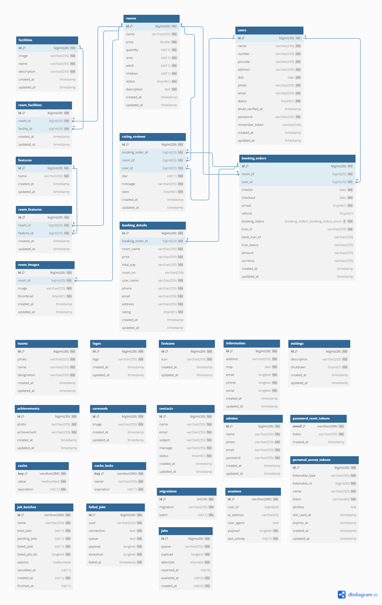
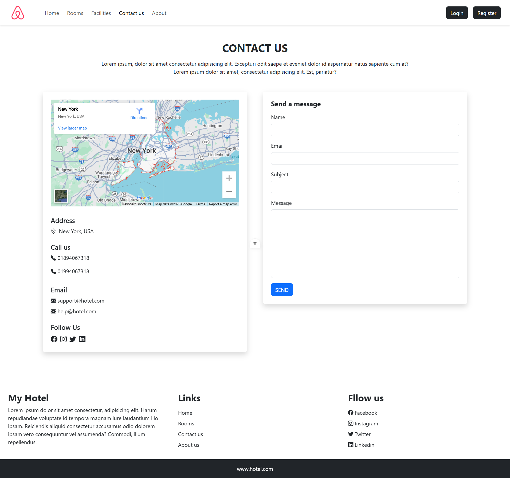
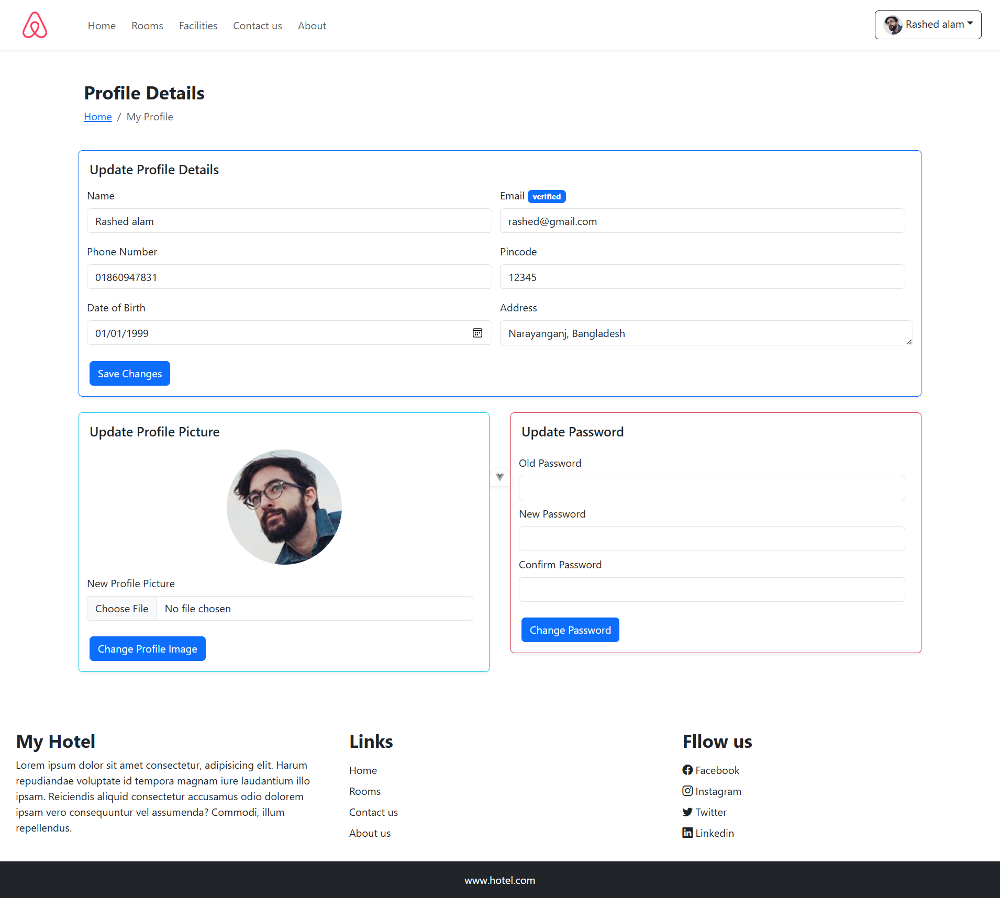
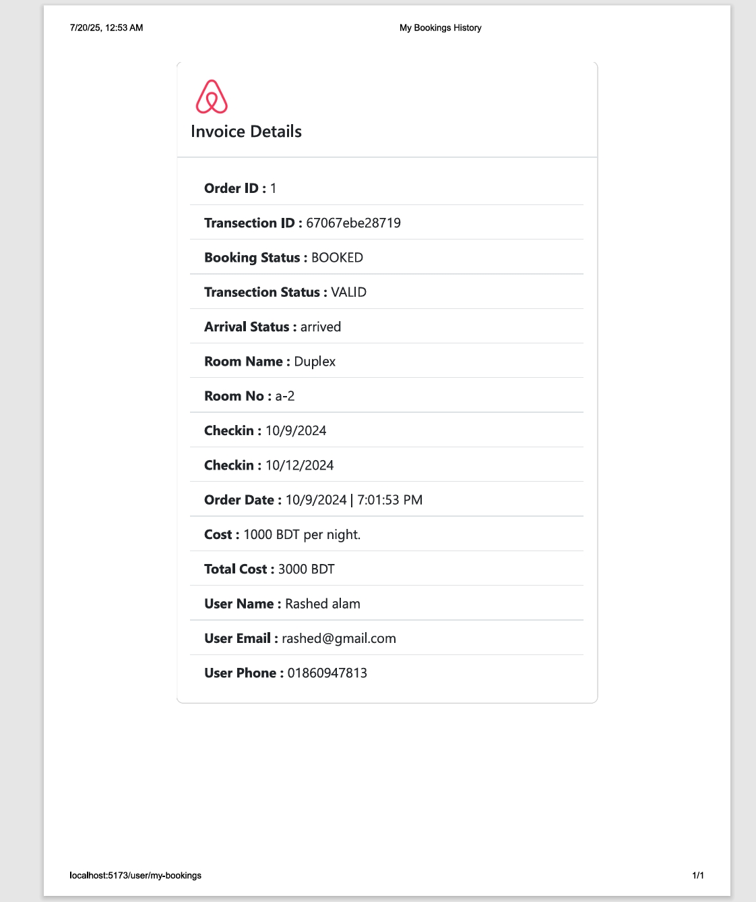

# MY HOTEL

my hotel is a hotel booking web app that comes will all the necessary feature for a hotel to get their business online. it allows users to book room , give review and ratings to the hotel services.

It is a hotel booking platform. the guests can check room availability , make reservations , view detaild room information , and provide feedback through integrated review and rating systems.

It include an admin panel for booking management , room control , fund & refund management , guest review monitoring and business analytics for informed decision making.

It provides real time booking availability , automated reservation management , and detaild reporting to help hotel owners optimize their operations.

It handles complete hotel content management including room details , feature & facility information, image galleries and SSLCOMMERZ payment getway.

#### If you use this project ? then follow the bellow instructions. 

## Installation Proccess
[Download the Project ( ZIP file ) ](https://github.com/code-with-Rashed/hotel/archive/refs/heads/master.zip)

Extract the project after download completed.

##### OR
You can clone this project
```
https://github.com/code-with-Rashed/hotel.git
```

##### Open your terminal then enter to your project folder like..
```
cd hotel
```

## Let's start setup the application's backend
1. enter to the backend folder
```
cd backend
```
2. install the  dependencies
```
composer install
```
3. Copy `.env.example` to `.env`
```
cp .env.example .env
```
4. Generate application key
```
php artisan key:generate
```
5. Public storage folder
```
php artisan storage:link
```
##### Set Environment Variables
1. To open the .env file
- You can set your database information. like...
```
DB_CONNECTION=mysql
DB_HOST=127.0.0.1
DB_PORT=3306
DB_DATABASE=backend
DB_USERNAME=root
DB_PASSWORD=
```
- You can set your email information. like...
```
MAIL_MAILER=smtp
MAIL_HOST=smtp.gmail.com
MAIL_PORT=587
MAIL_USERNAME=your-email-user-name@email.com
MAIL_PASSWORD=your-email-password
MAIL_ENCRYPTION=tls
MAIL_FROM_ADDRESS="your-email-address"
MAIL_FROM_NAME="${APP_NAME}"
```
2. open a sslcommerze payment getway account. then get your sslcommerze creadentials
- You can set your sslcommerze ( payment getway service ) information. like...
```
SSLC_SANDBOX=true # or false for live
SSLC_STORE_ID=your-sslcommerz-store-id
SSLC_STORE_PASSWORD=your-sslcommerz-store-password
SSLC_STORE_CURRENCY='BDT'
```
3.  You can need set your frontend application's exact url in the backend's .env file after setup this project's frontend. like..
```
FRONTEND_APP_URL=http://your-frontend-domain-name.com
```
4. Run Migrations
```
php artisan migrate:fresh
```
5. Run Database Seeders for default admin credential
```
php artisan db:seed --class=AdminDefaultCredential
```
This project's admin panel URL is `https://your-domain-name.com/admin`

Please note that the default admin email is `admin@gmail.com` and the default password is `12345`. You should change admin user credentials before deploying to production.

6. Start the webserver
```
php artisan serve
```
-  You can need set your backend application's exact url . like...
```
APP_URL=http://your-backend-domain-name.com
```
7. Run the laravel QUEUE after complete setup the .env file for asyncronus services.
```
php artisan queue:work
```

<hr/><hr/>

## Let's start setup the application's frontend
1. enter to the frontend folder
```sh
cd frontend
```
2. install the  dependencies
```sh
npm install
```
##### Set Environment Variables
1. To open the `.env` file
- You can need set your backend application's ( api's ) exact url. like...
```sh
VITE_API_URL=http://your-backend-api-domain-name.com
```
##### Run frontend application in development environment
```sh
npm run dev
```
##### If you need a production build? Then run this command.
```sh
npm run build
```
##### Run production build
```sh
npm run preview
```

<hr/><hr/>

#### This project's database diagram
<br><hr><br>

## Here are the project's UML diagrams
#### Here are the activity & use-case diagrams for the admin panel
<br><hr><br>
<br><hr><br>
#### Here are the activity & use-case diagrams for the customer panel
<br><hr><br>
<br><hr><br>

<br><hr><br>

#### Here are the project's related preview images for the customer panel
<br><hr><br>
<br><hr><br>
<br><hr><br>
<br><hr><br>
<br><hr><br>
<br><hr><br>
<br><hr><br>
<br><hr><br>
<br><hr><br>
<br><hr><br>
<br><hr><br>

#### Here are the project's related preview images for the user panel
<br><hr><br>
<br><hr><br>
<br><hr><br>
<br><hr><br>
<br><hr><br>

#### Here are the project's related preview images for the admin panel
<br><hr><br>
<br><hr><br>
<!-- Room management -->
<br><hr><br>
<br><hr><br>
<br><hr><br>
<br><hr><br>
<br><hr><br>
<!-- carousel management -->
<br><hr><br>
<br><hr><br>
<br><hr><br>
<!-- facility & feature management -->
<br><hr><br>
<br><hr><br>
<br><hr><br>
<br><hr><br>
<br><hr><br>
<br><hr><br>
<!-- achievement management -->
<br><hr><br>
<br><hr><br>
<br><hr><br>
<!-- address management -->
<br><hr><br>
<br><hr><br>
<!-- admin profile management -->
<br><hr><br>
<!-- contact request management -->
<br><hr><br>
<br><hr><br>
<!-- rating-review management -->
<br><hr><br>
<!-- settings management -->
<br><hr><br>
<!-- team profile management -->
<br><hr><br>
<br><hr><br>
<br><hr><br>
<!-- users management -->
<br><hr><br>
<br><hr><br>
<!-- booking management -->
<br><hr><br>
<br><hr><br>
<br><hr><br>


